# Active-Directory-Home-Lab

Windows Server AD DS ennterprise home lab

Deployed a Windows Server Active Directory Domain Services (AD DS) lab environment to simulate a real world enterprise network infrastructure. The lab was created to strengthen my experience in system administration, identity management, networking and Windows server administration.

## Technologies Used
Oracle VirtualBox (Virtualization Platform)
Windows Server 2022 (Domain Controller)
Windows 10/11 (Client Machines)
Active Directory Domain Services (AD DS)
DNS & DHCP Services
Group Policy Management

## Screenshots

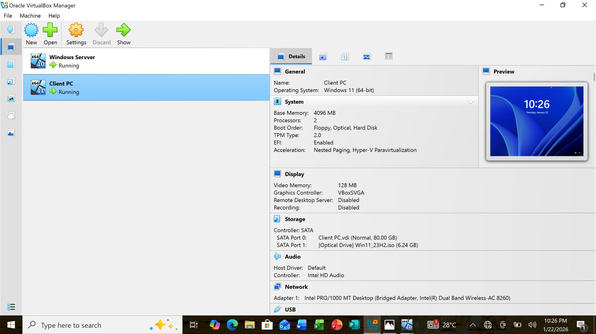

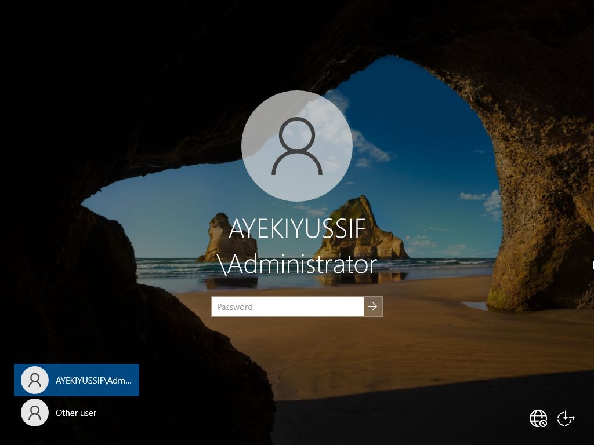

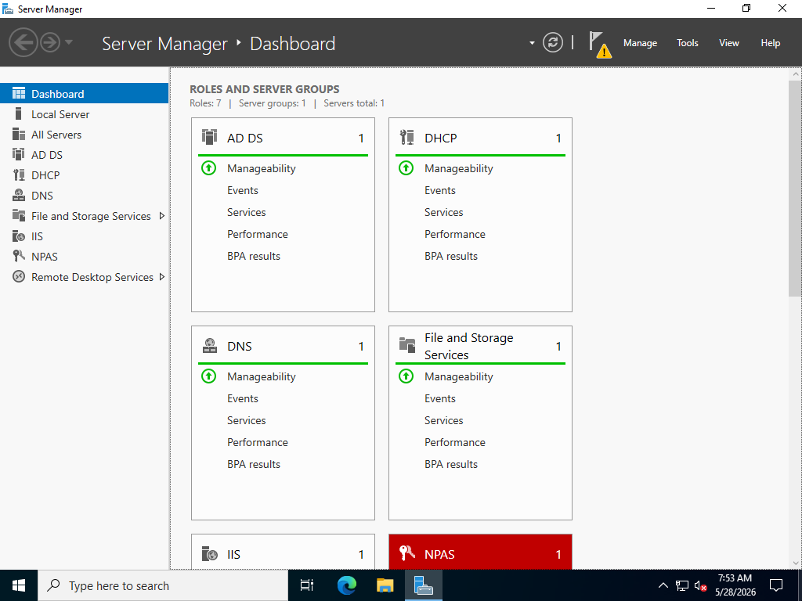

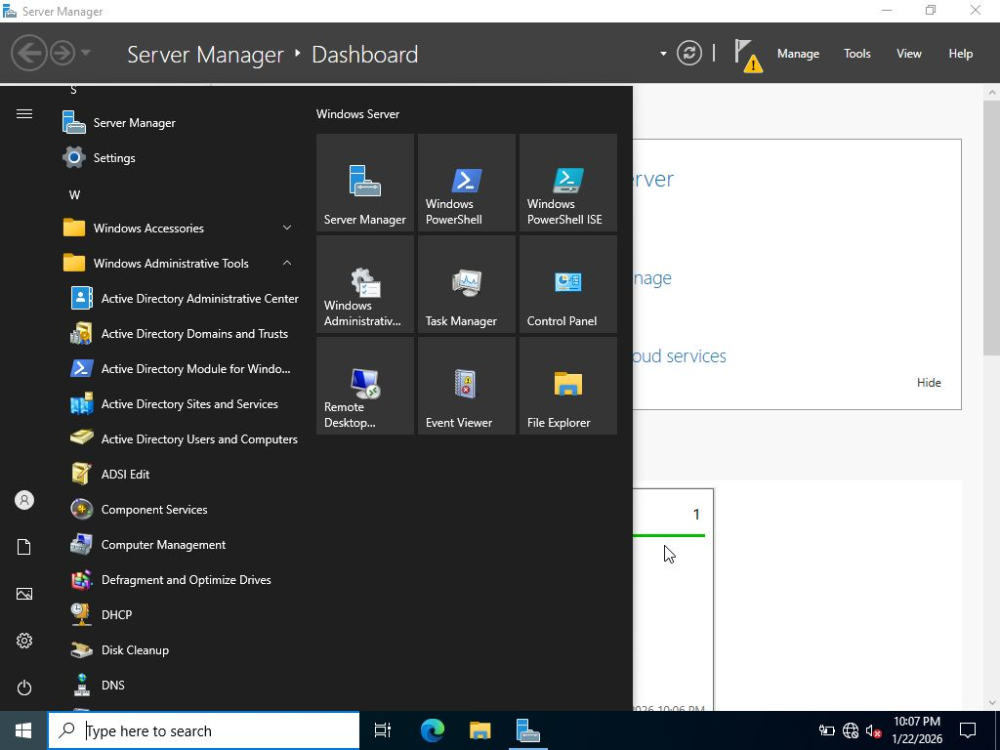

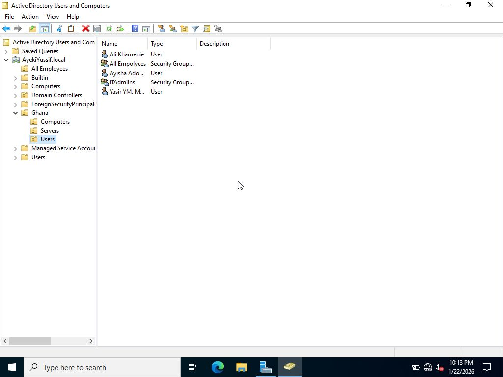

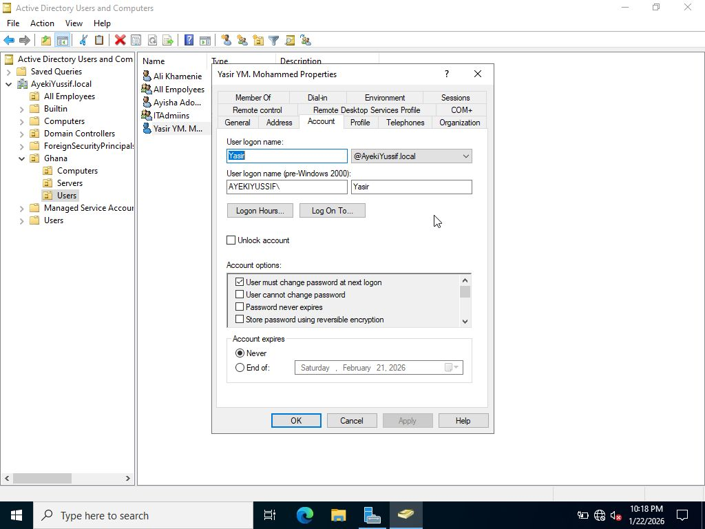

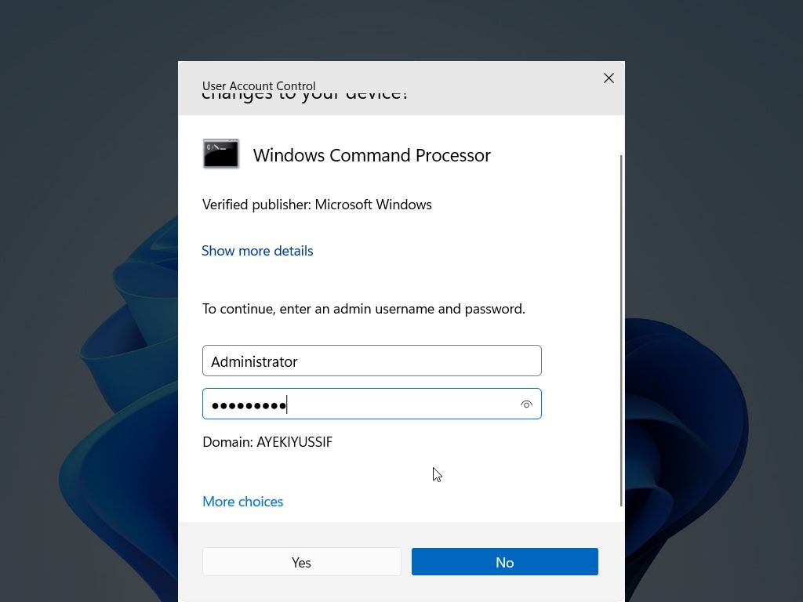

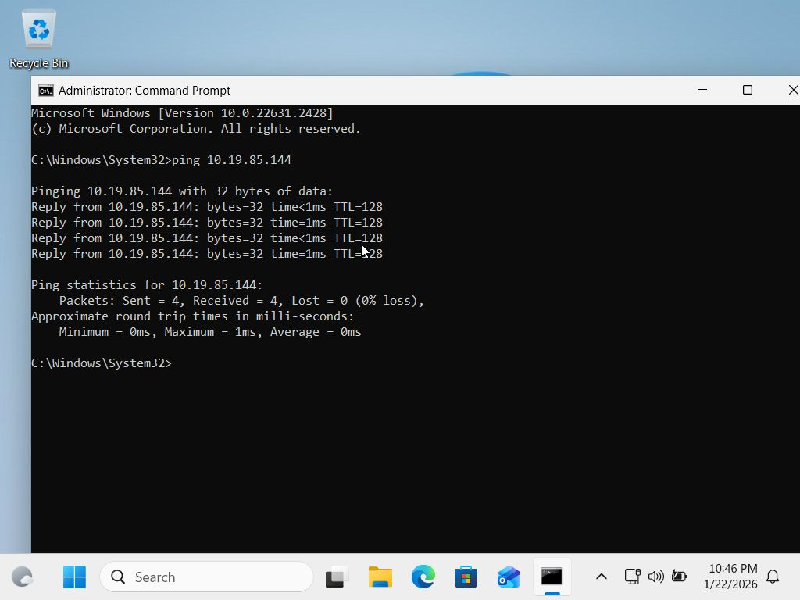

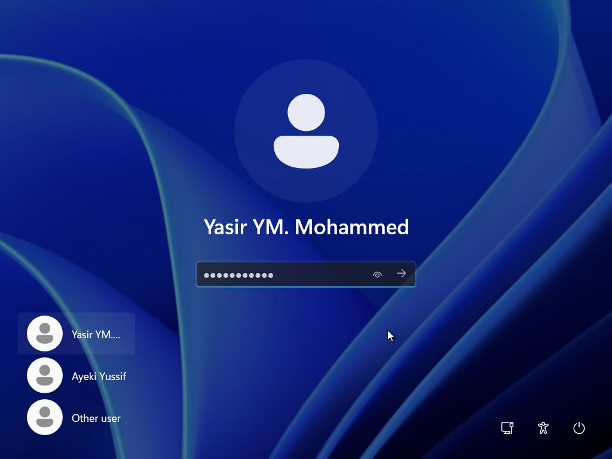

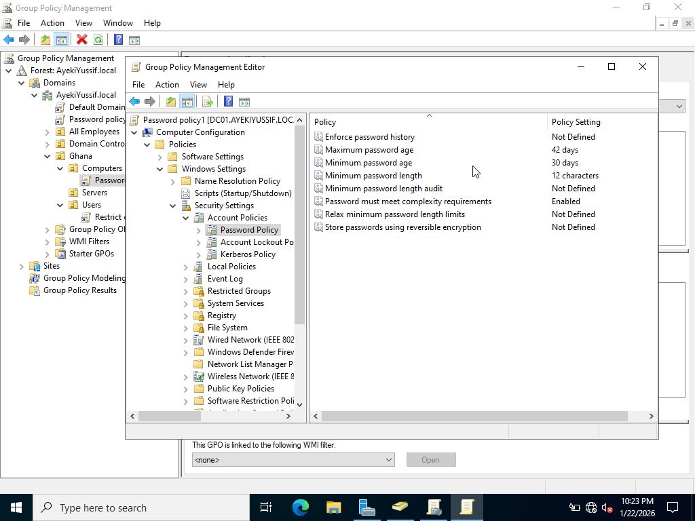

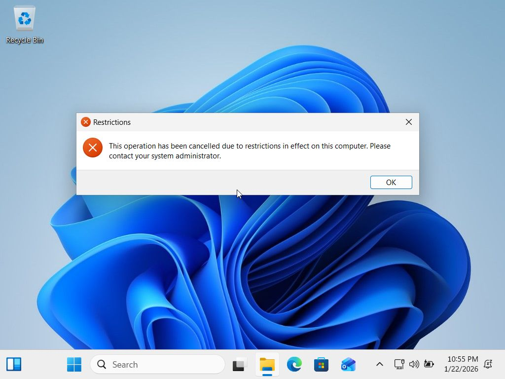

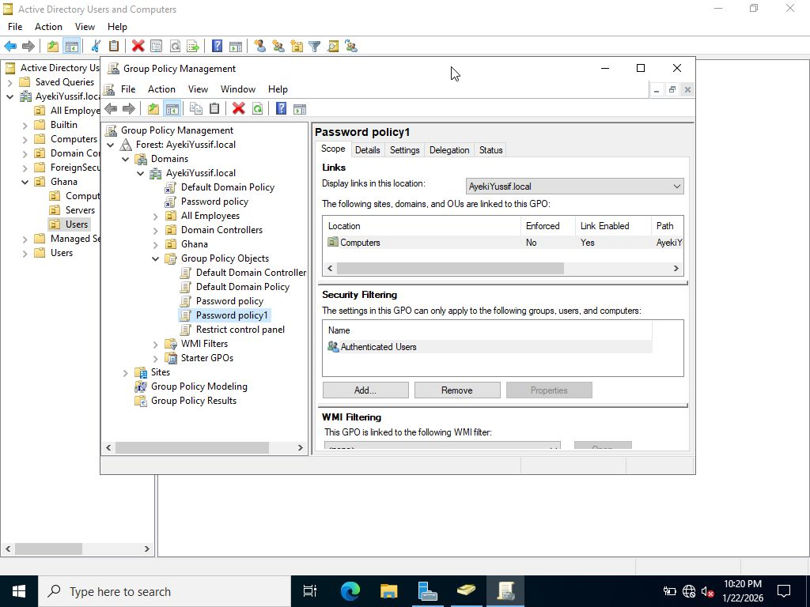

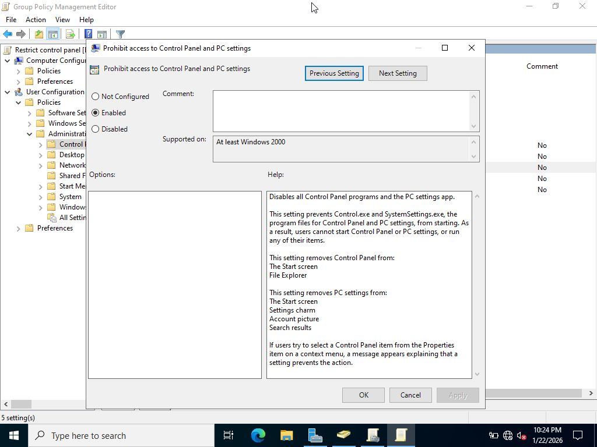

